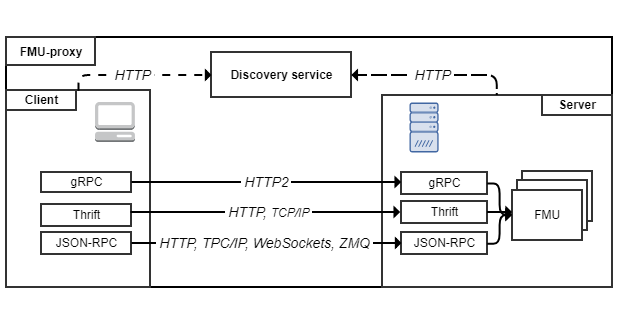

## FMU-proxy (work in progress)

[](https://opensource.org/licenses/MIT)
[](https://github.com/SFI-Mechatronics/FMU-proxy/issues)

The main goal of the Functional Mock-up Interface (FMI) standard is to allow simulation models to be shared across tools. 
To accomplish this, FMI relies on a combination of XML-files and compiled C-code packaged in a zip archive. 
This archive is called an Functional Mock-up Unit (FMU) and uses the extension .fmu. 
In theory, an FMU can support multiple platforms, however this is not always the case and depends on the type of binaries the exporting tool was able to provide. 
Furthermore, a library providing FMI support may not be available in a particular language or platform, and/or it may not support the whole standard. 
Another issue is related to the protection of Intellectual Property (IP). 
While an FMU is free to only provide the C-code in its binary form, other resources shipped with the FMU may be unprotected.   

In order to overcome these challenges, we present an open-source framework for working with functional mock-up units across languages and platforms. 
This is done by wrapping a set of FMUs inside a server program supporting multiple language independent Remote Procedure Calls (RPCs) and protocols over several network transports. 
Currently, Apache Thrift (HTTP, TCP/IP), gRPC (HTTP/2) and JSON-RPC (HTTP, WebSockets, TPC/IP, ZMQ) are supported. 

Together, they allow FMUs to be invoked from virtually any language on any platform.
As users don't have direct access to the FMU or the resources within it, IP is effectively protected.

***

FMU-proxy is a framework for accessing FMUs compatible with FMI for Co-simulation and Model Exchange 2.0 in a language and platform independent way. This is achieved using well established RPC technologies. Due to the technologies involved, clients and servers for FMU-proxy can be written in almost any language, on any platform! 

[Server](https://github.com/SFI-Mechatronics/FMU-proxy/wiki/Servers) implementations already exists for C++ and JVM, while [client](https://github.com/SFI-Mechatronics/FMU-proxy/wiki/Clients) implementations exists for C++, JVM, Python and (browser) JavaScript. And its easy to add additional implementations, as the RPC frameworks will generate most of the code for you! 

FMU-proxy is different from other framework for distributed FMU invocations such as [DACCOSIM](https://sourcesup.renater.fr/daccosim/), [FMI GO!](https://mimmi.math.umu.se/cosimulation/fmigo) and [Coral](https://github.com/viproma/coral) in that it completely separates itself from the master algorithm (logically and physically). FMU-proxy is a completely standalone project which provides access to FMUs over the wire. And just that. 

The idea is that other applications should use FMU-proxy whenever FMUs are required to run distributed, rather than having each application creating their own solution.

***

## Implementation


##### Server
This repository comes bundled with **server** implementations written in Kotlin (JVM) and C++. 


##### Client
The available **client** implementations are given in the table below:

|    RPC   	| [JVM](#jvm) 	| [C++](#cpp) 	| [Python](#python) 	| [Javascript](#javascript)
|:--------:	|:---:	|:---:	|:------:	|:------:		|
|   gRPC   	|  x  	|  x  	|    x   	|  			|
|  Thrift/TCP  	|  x  	|  x  	|    x   	|  			|  
|  Thrift/HTTP  |  x  	|    	|       	|	x		|
| JSON-RPC/ALL 	|  x  	|     	|        	|			|


**NOTE:** Thanks to the language independent nature of the RPC technologies and network protocols involved, servers and clients may be implemented in virtually any language with relative ease. 


### <a name="jvm"></a> JVM

The JVM implementation of FMU-proxy is written in Kotlin and uses the gradle build system. 

It features a server implementation that supports Apache Thrift (HTTP/JSON), TCP/IP/binary), gRPC(HTTP2) and JSON-RPC(HTTP, WebSockets, TCP/IP, ZMQ) RPCs.

For interacting with the FMUs on the JVM, [FMI4j](https://sfi-mechatronics.github.io/FMI4j/) is used. 
The JSON-RPC client and server implementation can be found [here](https://github.com/markaren/YAJ-RPC).

Clients has been implemented for all server end-points. A feature of the implemented clients is that they all implement the same interface. 
The interface is specified by FMI4j, allowing local and remote FMU instances to be used interchangeably in user code. 

[The discovery service](#discovery_service) has also been implemented in Kotlin.  

#### FMU-proxy executable

```
Usage: fmu-proxy [-h] [-avro=<avroPort>] [-grpc=<grpcPort>]
                 [-jsonrpc/http=<jsonHttpPort>] [-jsonrpc/tcp=<jsonTcpPort>]
                 [-jsonrpc/ws=<jsonWsPort>] [-jsonrpc/zmq=<jsonZmqPort>]
                 [-r=<remote>] [-thrift/http=<thriftHttpPort>]
                 [-thrift/tcp=<thriftTcpPort>] FMUs...
      FMUs...             FMU(s) to include.
      -grpc=<grpcPort>    Manually specify the gRPC port (optional).
  -h, --help              Print this message and quits.
      -jsonrpc/http=<jsonHttpPort>
                          Manually specify the JSON-RPC HTTP port (optional).
      -jsonrpc/tcp=<jsonTcpPort>
                          Manually specify the JSON-RPC TCP/IP port (optional).
      -jsonrpc/ws=<jsonWsPort>
                          Manually specify the JSON-RPC WS port (optional).
      -jsonrpc/zmq=<jsonZmqPort>
                          Manually specify the JSON-RPC ZMQ port (optional).
  -r, --remote=<remote>   Specify an address for the remoteAddress tracking server
                            (optional).
      -thrift/http=<thriftHttpPort>
                          Manually specify the Thrift http port (optional).
      -thrift/tcp=<thriftTcpPort>
                          Manually specify the Thrift tcp port (optional).

```

You can now connect to the FMU in a language of your choosing using one of the schemas available from the web server or located [here](rpc-definitions). 
When using JSON-RPC, no schema is required.

### <a name="cpp"></a> C++

It is no surprise that invoking FMUs on the JVM implies a certain performance overhead. 
That is why a server implementation of FMU-proxy has also been implemented in C++. 

The implementation uses the C++-library [_FMI4cpp](https://github.com/SFI-Mechatronics/FMI4cpp) for interacting with FMUs. 

The implementation supports Thrift and gRPC. Both servers and clients are available. 
The clients share a common interface with the FMI wrapper, making it possible to interchangably use local and remote FMUs in your code.. 

See [BUILDING.md](cpp/FMU-proxy/BUILDING.md) for notes on how to build the project for both Windows and Linux systems.

#### FMU-proxy executable

```
FMU-proxy
Options:
  -h [ --help ]         Print this help message and quits.
  --fmu arg             Path to FMUs.
  -r [ --remote ] arg   IP address of the remote tracking server.
  --thrift/tcp arg      Specify the network port to be used by the Thrift 
                        (TCP/IP) server.
  --thrift/http arg     Specify the network port to be used by the Thrift 
                        (HTTP) server.
  --grpc/http2 arg      Specify the network port to be used by the gRPC server.
```

### <a name="python"></a> Python

This repository comes bundled with simple client implementations in Python for gRPC and Thrift.


### <a name="javascript"></a> JavaScript

A simple Thrift client running in the browser can be found [here](browser/thrift/index.html). 


## Software Architecture



#### <a name="discovery_service"></a> The Discovery Service

The discovery service is a centralized web service which FMU-proxy servers connects to. 
As there may be many discovery services online (each company could have they own), the IP and Port should be provided to the FMU-proxy server uppon startup.
The service has a HTTP API that allows clients to query for available FMUs. 
The response is a JSON array with the necessary information required to connect to the FMUs directly. 

The service features a web-based GUI, where users can lookup information retrieved from the FMUs _modelDescription.xml_.

***

#### Running Tests

In order to run the tests, a system variable named __TEST_FMUs__ must be present on your system. This variable should point to the location of the content found [here](https://github.com/markaren/TEST_FMUs).


